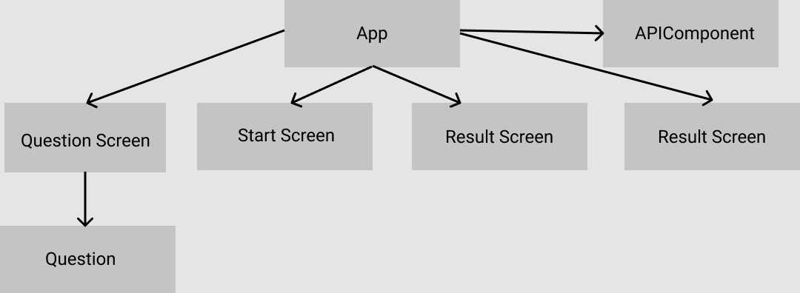

# Trivia game with Vue 3 (Assignment 

**Instructions:** Write a working mini-game that prompts users for a difficulty level, how many questions they want and from which category. Display the questions, one at a time and show the results of the answers at the end of the game.

**Goal:** On completion of this assignment, you will be able to: 

- Create a new Vue (3.x) application using the CLI
- Use Vue components to build an application
- Use the Vue Router to navigate between components
- You must deploy your assignment to a publicly accessible address, i.e. with Gitlab Pages, Heroku, or similar
 - Optional: You may use Vuex for state management

[Application Demo](https://glacial-journey-04728.herokuapp.com/)

## Component Tree



## Development

```bash
# Clone project
git clone https://github.com/accez/Trivia-game.git

# Install dependencies
npm install

# Run local dev server
npm run dev
```
### Recommended IDE Setup
- [VSCode](https://code.visualstudio.com/) + [Volar](https://marketplace.visualstudio.com/items?itemName=johnsoncodehk.volar)

## Maintainers
[@Simon Palmgren](https://github.com/accez)

[@Love Beling](https://github.com/mikaellove)

## License
[MIT](https://choosealicense.com/licenses/mit/)
